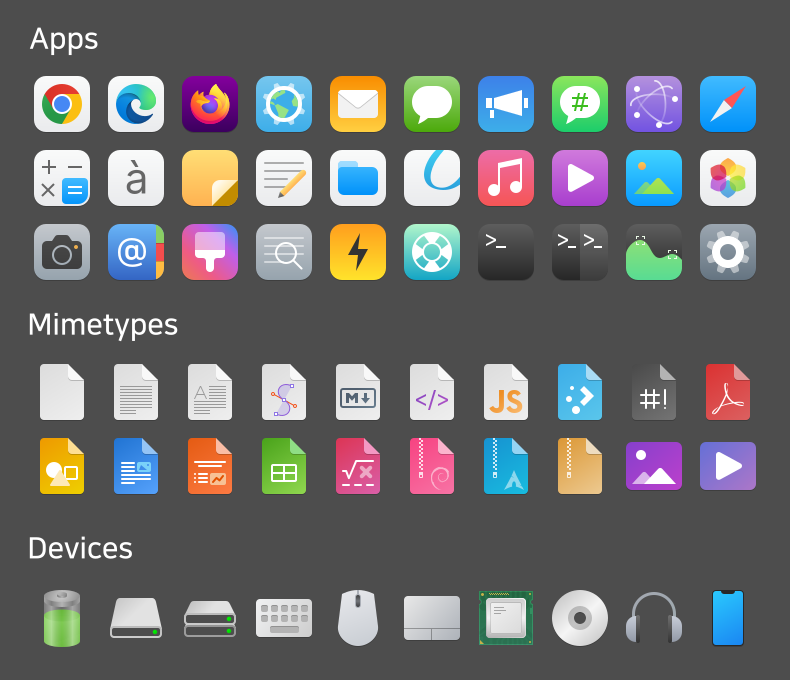
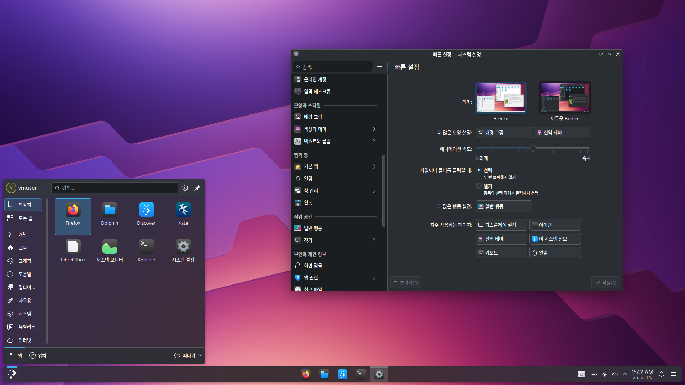
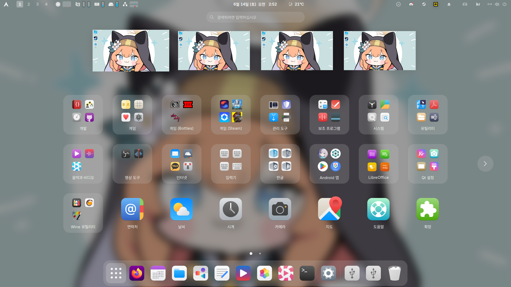

# Pure-icon-theme
Mac-Like icon theme for Linux Desktops

## Features

* Mac-Like Designs
* KDE 6 Support
* iOS18-Style Dark Mode icons

## Based On

* Fluent-icon-theme by vinceliuice - almost symbolic icons
* Stylish-icon-theme by mjkim0727

## To-Dos

- [ ] Full-Support KDE Color Scheme

 - [ ] Folder Color

- [ ] Packaging Icon Theme

- [x] Improve Compatiblity for KDE 6 (22~24px symbolic icons)

- [x] iOS18-Style Dark Mode icon (Out-of-Box apps almost applied)

## Install

### via sources

Open terminal, and run install.sh file.

```
$ ./install.sh
```

## Preview



## Screenshot

*  KDE



*  GNOME



*  Xfce
